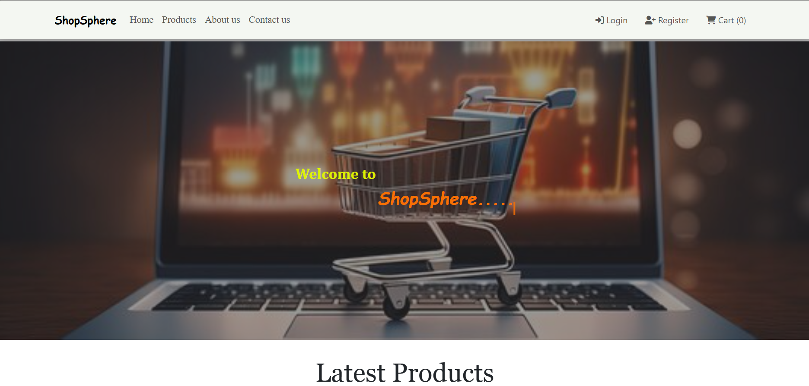
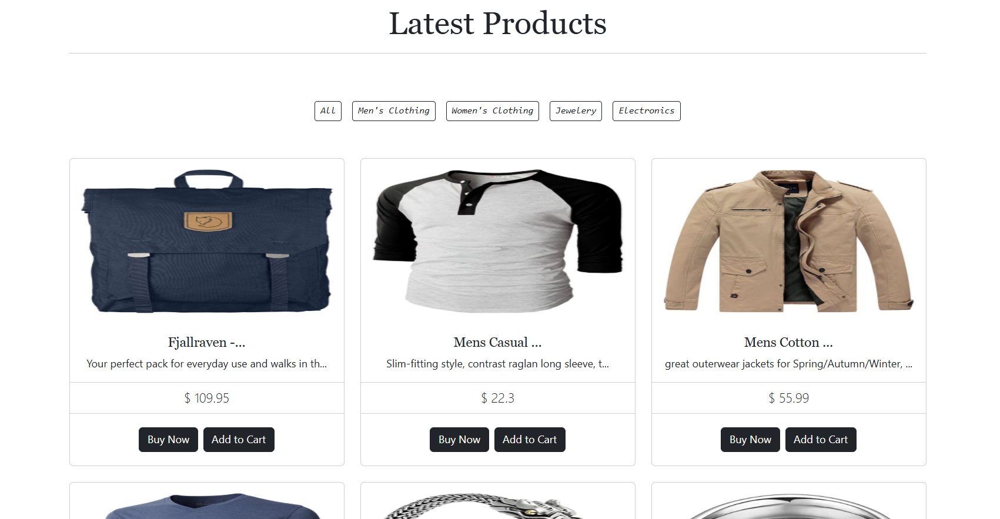

# 🛒 ShopSpher - E-Commerce Web Application

- **ShopSpher** is a modern and responsive E-Commerce web application built using **React**, **Redux**, and **Axios**. It provides users with a seamless shopping experience where they can browse products, manage their cart, and proceed to a simple checkout.

## 🚀 Features

- 🔍 Browse and search for products
- 🛍️ Add or remove products from the shopping cart
- 🧮 Update quantity and view cart total
- ✅ Checkout page with order summary
- 🌐 Global state management using Redux
- 🔗 Real-time data fetching via Axios
- 📱 Responsive UI for desktop and mobile

## 🛠️ Tech Stack

- **Frontend:** React.js
- **State Management:** Redux
- **HTTP Client:** Axios
- **Styling:** CSS
- **Deployment:** Firebase Hosting

## 📁 Project Structure

```bash
ShopSpher/
├── build/
├── public/
├── src/
│ ├── components/
│ ├── redux/
│ │ ├── action/
│ │ ├── reducer/
│ │ └── store.js
│ ├── resources/
│ ├── App.js
│ ├── App.css
│ ├── index.js
│ └── index.css
├── .gitignore
├── .firebaserc
├── firebase.json
├── package.json
├── package-lock.json
└── README.md

```

## 🔌 Installation

1. **Clone the repository:**

   ```bash
   git clone https://github.com/your-username/shopspher.git
   cd shopspher
   ```

2. **Install dependencies**:

   - npm install

3. **Start the development server:**
   - npm start

### Screenshot





#### [🚀 View Live Demo](https://shopsphere-4de2b.web.app/)
